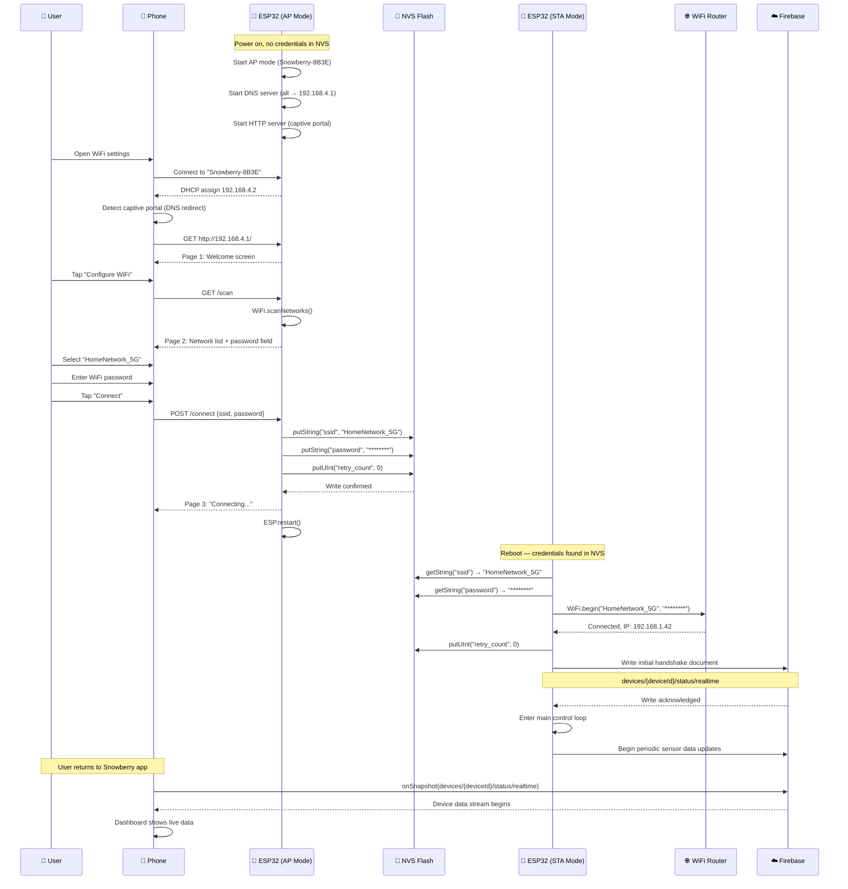

# Snowberry — ESP32 ↔ App Handshake Protocol

## 1. Overview

The device pairing flow establishes a secure link between the Snowberry ESP32 greenhouse controller and the user's smartphone app. The process accomplishes two things: it connects the ESP32 to the user's local WiFi network so it can communicate with Firebase, and it registers the device in the Firebase Firestore backend so the app can discover and control it.

The ESP32 cannot use Bluetooth for provisioning because the target hardware (ESP32-WROOM-32) dedicates its radio to WiFi during normal operation, and simultaneous BLE+WiFi provisioning adds complexity and power draw that is unnecessary for a device that only pairs once. Instead, the ESP32 creates a temporary WiFi access point (AP mode) that the user connects to with their phone. A captive portal web page served from the ESP32's flash memory guides the user through entering their home WiFi credentials. Once the credentials are submitted, the ESP32 stores them in non-volatile storage (NVS), reboots into station mode (STA), connects to the home network, and writes its initial registration document to Firestore.

The entire pairing process takes under 60 seconds for a user who knows their WiFi password.

---

## 2. Pairing Trigger Conditions

The ESP32 enters AP mode (pairing mode) under three conditions:

### Condition 1 — First Boot (No Stored Credentials)

On power-up, the firmware reads the `wifi_cred` NVS namespace for stored SSID and password strings. If either string is empty or the namespace does not exist, the device has never been paired. It immediately enters AP mode without attempting any WiFi connection.

### Condition 2 — Long-Press Factory Reset

A momentary push button is connected to GPIO 4 with an internal pull-up resistor. During normal operation (STA mode, connected to WiFi), if the user presses and holds this button for more than 5 seconds, the firmware:

1. Clears the `wifi_cred` NVS namespace (erases stored SSID and password).
2. Resets the retry counter to 0.
3. Restarts the ESP32 via `ESP.restart()`.
4. On reboot, Condition 1 applies — no credentials found, enters AP mode.

The 5-second hold duration prevents accidental resets. The firmware debounces the button and measures hold duration using `millis()`.

### Condition 3 — Exhausted Connection Retries

If the ESP32 has stored credentials but fails to connect to the WiFi network, it retries with exponential backoff:

| Retry # | Delay Before Retry |
|---|---|
| 1 | 2 seconds |
| 2 | 4 seconds |
| 3 | 8 seconds |
| 4 | 16 seconds |
| 5 | 32 seconds |

After 5 consecutive failures (total elapsed time approximately 62 seconds), the ESP32 clears the stored credentials, resets the retry counter, and enters AP mode. The rationale for clearing credentials after 5 failures: if the password was entered incorrectly during pairing, the user needs to re-enter it, which requires AP mode. If the router is simply down temporarily, the user can re-pair with the same password once the router recovers.

The retry counter is persisted in NVS (key: `retry_count` in the `wifi_cred` namespace) so that retries survive power cycles. On successful connection, the counter is immediately reset to 0.

---

## 3. AP Mode Configuration

### Network Settings

| Parameter | Value |
|---|---|
| SSID | `Snowberry-XXXX` |
| SSID suffix (XXXX) | Last 4 hexadecimal digits of ESP32's base MAC address, uppercase. Example: if MAC is `A4:CF:12:F0:8B:3E`, SSID is `Snowberry-8B3E`. |
| Password | None (open network) |
| Channel | 1 (default) |
| Max connections | 1 |
| IP address | 192.168.4.1 |
| Subnet mask | 255.255.255.0 |
| DHCP range | 192.168.4.2 – 192.168.4.5 |

### Why Open Network

The AP is intentionally unencrypted. The pairing session is a one-time event lasting under 60 seconds, the AP has a range of approximately 10 meters, and the only data transmitted is the user's home WiFi SSID and password over a local HTTP connection. Adding a WPA2 password to the AP would require printing a unique password on each device or displaying it on a screen (which the device does not have), both of which add cost and complexity without meaningful security benefit for a sub-60-second local interaction.

### DNS Captive Portal Redirect

The ESP32 runs a minimal DNS server that responds to all DNS queries with `192.168.4.1`. This triggers the operating system's captive portal detection mechanism on both iOS and Android, causing the phone to automatically open a browser window pointed at the ESP32's web server. If the automatic detection fails, the user can manually navigate to `http://192.168.4.1` in any browser.

---

## 4. Captive Portal Web Interface

The captive portal is a set of three HTML pages served from the ESP32's flash memory via the `WebServer` library. All HTML, CSS, and JavaScript are embedded in the firmware binary as raw string literals (PROGMEM). No external CDN dependencies.

### Page 1 — Welcome

```
┌──────────────────────────────────────┐
│                                      │
│          🍓 Snowberry                │
│     Smart Greenhouse Controller      │
│                                      │
│     Device ID: Snowberry-8B3E        │
│                                      │
│     [ Tap to Configure WiFi ]        │
│                                      │
└──────────────────────────────────────┘
```

- Displays the Snowberry logo (inline SVG or base64 PNG embedded in HTML).
- Shows the device ID (same as AP SSID) so the user can confirm they connected to the correct device.
- Single button navigates to Page 2.

### Page 2 — WiFi Scanner

```
┌──────────────────────────────────────┐
│  Select Your WiFi Network           │
│                                      │
│  ┌────────────────────────────────┐  │
│  │ 📶 HomeNetwork_5G      -42dBm │  │
│  ├────────────────────────────────┤  │
│  │ 📶 HomeNetwork_2.4     -55dBm │  │
│  ├────────────────────────────────┤  │
│  │ 📶 Neighbor_WiFi       -78dBm │  │
│  └────────────────────────────────┘  │
│                                      │
│  Password: [________________]        │
│                                      │
│          [ Connect ]                 │
│                                      │
│          [ Scan Again ]              │
│                                      │
└──────────────────────────────────────┘
```

On page load, the ESP32 performs a `WiFi.scanNetworks()` call and returns the results as a JSON array to the page. The page renders each network as a tappable list item showing the SSID and signal strength in dBm. Duplicate SSIDs (same network on multiple channels) are deduplicated, keeping the strongest signal. Hidden networks (empty SSID) are excluded.

When the user taps a network, it becomes highlighted and a password input field appears below the list. The SSID is pre-filled and read-only. The user types their WiFi password and taps "Connect."

The "Scan Again" link re-triggers `WiFi.scanNetworks()` and refreshes the list without leaving the page.

On submit, the page sends a POST request to `http://192.168.4.1/connect` with form data:
- `ssid` — the selected network's SSID (URL-encoded)
- `password` — the user-entered password (URL-encoded)

### Page 3 — Connection Status

```
┌──────────────────────────────────────┐
│                                      │
│     Connecting to HomeNetwork_5G...  │
│     ████████░░░░░░░░ 50%             │
│                                      │
└──────────────────────────────────────┘
```

After submitting credentials, the browser shows a progress bar page. The page polls `http://192.168.4.1/status` every 2 seconds via JavaScript `fetch()`. The ESP32 responds with a JSON object:

```json
{ "status": "connecting" | "connected" | "failed", "ip": "192.168.1.42" }
```

**Success state:**

```
┌──────────────────────────────────────┐
│                                      │
│     ✅ Connected!                    │
│                                      │
│     Snowberry is now online.         │
│     IP: 192.168.1.42                 │
│                                      │
│     You can close this page and      │
│     return to the Snowberry app.     │
│                                      │
└──────────────────────────────────────┘
```

**Failure state:**

```
┌──────────────────────────────────────┐
│                                      │
│     ❌ Could not connect.            │
│                                      │
│     Please check your password       │
│     and try again.                   │
│                                      │
│     [ Back to WiFi List ]            │
│                                      │
└──────────────────────────────────────┘
```

The "Back to WiFi List" button navigates to Page 2, allowing the user to re-enter credentials without power-cycling the device.

---

## 5. NVS Credential Storage — Full Arduino C++ Code

```cpp
#include <Preferences.h>
#include <Arduino.h>

Preferences preferences;

// Namespace for WiFi credentials in NVS
const char* NVS_NAMESPACE   = "wifi_cred";
const char* NVS_KEY_SSID    = "ssid";
const char* NVS_KEY_PASS    = "password";
const char* NVS_KEY_RETRIES = "retry_count";

/**
 * Initialize the NVS preferences in read-write mode.
 * Returns true if the namespace opened successfully.
 */
bool nvsInit() {
    bool success = preferences.begin(NVS_NAMESPACE, false); // false = read-write
    if (!success) {
        Serial.println("[NVS] ERROR: Failed to open namespace 'wifi_cred'");
    }
    return success;
}

/**
 * Store WiFi credentials (SSID and password) into NVS.
 * Also resets the retry counter to 0 on successful storage.
 * Returns true if both values were stored successfully.
 */
bool nvsStoreCredentials(const String& ssid, const String& password) {
    if (ssid.length() == 0) {
        Serial.println("[NVS] ERROR: SSID is empty, refusing to store");
        return false;
    }
    if (ssid.length() > 32) {
        Serial.println("[NVS] ERROR: SSID exceeds 32 characters");
        return false;
    }
    if (password.length() > 63) {
        Serial.println("[NVS] ERROR: Password exceeds 63 characters");
        return false;
    }

    size_t ssidWritten = preferences.putString(NVS_KEY_SSID, ssid);
    size_t passWritten = preferences.putString(NVS_KEY_PASS, password);

    if (ssidWritten == 0 || passWritten == 0) {
        Serial.println("[NVS] ERROR: Failed to write credentials to NVS");
        return false;
    }

    // Reset retry counter on fresh credential storage
    preferences.putUInt(NVS_KEY_RETRIES, 0);

    Serial.printf("[NVS] Credentials stored. SSID: '%s' (%d bytes), Password: (%d bytes)\n",
                  ssid.c_str(), ssidWritten, passWritten);
    return true;
}

/**
 * Read WiFi credentials from NVS.
 * Returns true if both SSID and password are non-empty.
 */
bool nvsReadCredentials(String& ssid, String& password) {
    ssid     = preferences.getString(NVS_KEY_SSID, "");
    password = preferences.getString(NVS_KEY_PASS, "");

    if (ssid.length() == 0) {
        Serial.println("[NVS] No stored SSID found (first boot or factory reset)");
        return false;
    }

    Serial.printf("[NVS] Credentials loaded. SSID: '%s'\n", ssid.c_str());
    return true;
}

/**
 * Check if valid WiFi credentials exist in NVS.
 */
bool nvsHasCredentials() {
    String ssid = preferences.getString(NVS_KEY_SSID, "");
    return ssid.length() > 0;
}

/**
 * Clear all stored WiFi credentials and retry counter.
 * Called on factory reset (long-press button) or after exhausting retries.
 */
void nvsClearCredentials() {
    preferences.remove(NVS_KEY_SSID);
    preferences.remove(NVS_KEY_PASS);
    preferences.putUInt(NVS_KEY_RETRIES, 0);
    Serial.println("[NVS] Credentials and retry counter cleared");
}

/**
 * Get the current retry count from NVS.
 */
uint32_t nvsGetRetryCount() {
    return preferences.getUInt(NVS_KEY_RETRIES, 0);
}

/**
 * Increment the retry counter in NVS.
 * Returns the new retry count.
 */
uint32_t nvsIncrementRetryCount() {
    uint32_t count = preferences.getUInt(NVS_KEY_RETRIES, 0);
    count++;
    preferences.putUInt(NVS_KEY_RETRIES, count);
    Serial.printf("[NVS] Retry counter incremented to %u\n", count);
    return count;
}

/**
 * Reset the retry counter to 0.
 * Called after a successful WiFi connection.
 */
void nvsResetRetryCount() {
    preferences.putUInt(NVS_KEY_RETRIES, 0);
    Serial.println("[NVS] Retry counter reset to 0");
}

/**
 * Close the NVS preferences handle.
 * Call this when NVS access is no longer needed (e.g., entering deep sleep).
 */
void nvsClose() {
    preferences.end();
    Serial.println("[NVS] Preferences handle closed");
}
```

---

## 6. STA Mode Connection Sequence — Full Code

```cpp
#include <WiFi.h>
#include <Preferences.h>

// Forward declarations from NVS module (Section 5)
extern bool nvsInit();
extern bool nvsReadCredentials(String& ssid, String& password);
extern bool nvsHasCredentials();
extern void nvsClearCredentials();
extern uint32_t nvsGetRetryCount();
extern uint32_t nvsIncrementRetryCount();
extern void nvsResetRetryCount();

// Forward declaration for AP mode entry
extern void enterAPMode();

// Forward declaration for main application loop
extern void enterMainLoop();

const uint32_t WIFI_CONNECT_TIMEOUT_MS = 15000;  // 15 seconds per attempt
const uint32_t MAX_RETRIES             = 5;

/**
 * Attempt to connect to WiFi using stored NVS credentials.
 * Implements exponential backoff on failure.
 * After MAX_RETRIES failures, clears credentials and enters AP mode.
 */
void attemptWiFiConnection() {
    String ssid, password;

    // Step 1: Read credentials from NVS
    if (!nvsReadCredentials(ssid, password)) {
        Serial.println("[WiFi] No credentials found. Entering AP mode for pairing.");
        enterAPMode();
        return;  // enterAPMode() does not return during normal operation
    }

    Serial.printf("[WiFi] Attempting connection to '%s'\n", ssid.c_str());

    // Step 2: Disconnect any existing connection and set mode
    WiFi.disconnect(true);
    WiFi.mode(WIFI_STA);

    // Step 3: Begin connection
    WiFi.begin(ssid.c_str(), password.c_str());

    // Step 4: Wait for connection with timeout
    uint32_t startMs = millis();
    while (WiFi.status() != WL_CONNECTED) {
        if (millis() - startMs > WIFI_CONNECT_TIMEOUT_MS) {
            Serial.println("[WiFi] Connection timed out after 15 seconds");
            WiFi.disconnect(true);
            handleConnectionFailure();
            return;
        }
        delay(250);
        Serial.print(".");
    }

    // Step 5: Connection successful
    Serial.println();
    Serial.printf("[WiFi] Connected! IP: %s, RSSI: %d dBm\n",
                  WiFi.localIP().toString().c_str(),
                  WiFi.RSSI());

    // Step 6: Reset retry counter on success
    nvsResetRetryCount();

    // Step 7: Proceed to main application loop
    enterMainLoop();
}

/**
 * Handle a failed WiFi connection attempt.
 * Increments retry counter with exponential backoff.
 * If retries exhausted, clears credentials and enters AP mode.
 */
void handleConnectionFailure() {
    uint32_t retryCount = nvsIncrementRetryCount();
    Serial.printf("[WiFi] Connection failed. Retry %u of %u\n", retryCount, MAX_RETRIES);

    if (retryCount >= MAX_RETRIES) {
        Serial.println("[WiFi] Max retries exhausted. Clearing credentials and entering AP mode.");
        nvsClearCredentials();
        enterAPMode();
        return;  // enterAPMode() does not return
    }

    // Exponential backoff: 2^retryCount seconds (2, 4, 8, 16, 32)
    uint32_t backoffMs = (1 << retryCount) * 1000;
    Serial.printf("[WiFi] Waiting %u ms before next retry\n", backoffMs);
    delay(backoffMs);

    // Recursive retry
    attemptWiFiConnection();
}

/**
 * Main setup function.
 * Initializes NVS, checks for stored credentials, and either
 * connects to WiFi or enters AP mode for pairing.
 */
void setup() {
    Serial.begin(115200);
    delay(500);
    Serial.println("\n[Boot] Snowberry Greenhouse Controller starting...");

    // Initialize NVS
    if (!nvsInit()) {
        Serial.println("[Boot] CRITICAL: NVS initialization failed. Treating as first boot.");
        enterAPMode();
        return;
    }

    // Check for stored credentials
    if (nvsHasCredentials()) {
        Serial.println("[Boot] Credentials found in NVS. Attempting WiFi connection.");
        attemptWiFiConnection();
    } else {
        Serial.println("[Boot] No credentials in NVS. Entering AP mode for first-time setup.");
        enterAPMode();
    }
}

void loop() {
    // Main loop is handled by enterMainLoop() after successful connection,
    // or by the AP mode web server event loop.
    // This function is intentionally empty because control flow is managed
    // by the connection/AP state machine above.
}
```

### Factory Reset Button Handler

This code runs in `setup()` as a parallel task or is integrated into the main loop via polling:

```cpp
const int BUTTON_PIN        = 4;       // GPIO 4
const uint32_t HOLD_TIME_MS = 5000;    // 5 seconds for factory reset

/**
 * Initialize the factory reset button.
 * Call this in setup() after Serial.begin().
 */
void initResetButton() {
    pinMode(BUTTON_PIN, INPUT_PULLUP);  // Active LOW (pressed = LOW)
}

/**
 * Check if the factory reset button is being held.
 * Call this in loop() or via a timer interrupt.
 * Non-blocking: tracks press start time and checks duration each call.
 */
void checkResetButton() {
    static uint32_t pressStartMs = 0;
    static bool wasPressed       = false;

    bool isPressed = (digitalRead(BUTTON_PIN) == LOW);

    if (isPressed && !wasPressed) {
        // Button just pressed — record start time
        pressStartMs = millis();
        wasPressed   = true;
        Serial.println("[Button] Press detected, hold for 5 seconds to factory reset");
    }

    if (isPressed && wasPressed) {
        // Button still held — check duration
        if (millis() - pressStartMs >= HOLD_TIME_MS) {
            Serial.println("[Button] 5-second hold detected. Performing factory reset.");
            nvsClearCredentials();
            Serial.println("[Button] Credentials cleared. Restarting...");
            delay(500);
            ESP.restart();
        }
    }

    if (!isPressed && wasPressed) {
        // Button released before 5 seconds — cancel
        wasPressed = false;
        Serial.println("[Button] Released before 5 seconds. Reset cancelled.");
    }
}
```

---

## 7. First Online Handshake Payload

When the ESP32 successfully connects to WiFi for the first time (or after a factory reset and re-pairing), it writes an initial registration document to Firestore. This document establishes the device's identity in the backend and allows the mobile app to discover and control it.

### Firestore Path

```
devices/{deviceId}/status/realtime
```

Where `{deviceId}` is derived from the ESP32's base MAC address, formatted as 12 uppercase hex characters without colons. Example: MAC `A4:CF:12:F0:8B:3E` → deviceId `A4CF12F08B3E`.

### JSON Payload

```json
{
    "device_id": "A4CF12F08B3E",
    "firmware_version": "1.0.0",
    "mac_address": "A4:CF:12:F0:8B:3E",
    "ip_address": "192.168.1.42",
    "wifi_rssi": -47,
    "first_seen": "2026-07-02T13:55:00Z",
    "last_seen": "2026-07-02T13:55:00Z",
    "hardware_revision": "v2.1",
    "sensors": {
        "temperature": null,
        "humidity": null,
        "light": null,
        "soil_moisture": null
    },
    "actuators": {
        "growlight": { "state": false, "mode": "AUTO", "manual_expires_at": null },
        "pump":      { "state": false, "mode": "AUTO", "manual_expires_at": null },
        "mist":      { "state": false, "mode": "AUTO", "manual_expires_at": null },
        "fan":       { "state": false, "mode": "AUTO", "manual_expires_at": null }
    },
    "faults": []
}
```

### Field Descriptions

| Field | Type | Description |
|---|---|---|
| `device_id` | string | Unique device identifier derived from MAC address. Immutable after creation. |
| `firmware_version` | string | Semantic version of the currently running firmware. Updated OTA. |
| `mac_address` | string | ESP32 base MAC address in colon-separated hex format. |
| `ip_address` | string | Current local IP address assigned by the router's DHCP server. |
| `wifi_rssi` | integer | WiFi signal strength in dBm at the time of the handshake. Updated periodically during operation. |
| `first_seen` | timestamp | ISO 8601 timestamp of the first-ever successful connection. Set once, never overwritten. |
| `last_seen` | timestamp | ISO 8601 timestamp of the most recent heartbeat. Updated every 30 seconds during normal operation. Used by the app to detect offline status (>5 minutes stale = offline). |
| `hardware_revision` | string | PCB revision identifier. Read from a compile-time constant in the firmware. |
| `sensors` | object | Current sensor readings. Initialized to `null` on first handshake; populated within 5 seconds as the sensor polling loop starts. |
| `actuators` | object | Current state and mode of each actuator. All initialized to OFF and AUTO. |
| `faults` | array | Active fault codes. Empty on initial handshake. Populated when the firmware detects sensor failures, actuator anomalies, or communication errors. |

---

## 8. Sequence Diagram



---

## 9. Edge Cases & Recovery

### Case 1 — User Closes Browser Before Submitting Credentials

**Scenario:** The user connects to the Snowberry AP, the captive portal opens, but the user closes the browser or navigates away before entering WiFi credentials and tapping "Connect."

**Behavior:** The ESP32 remains in AP mode indefinitely. The HTTP server continues running and will serve the captive portal to any new connection. No credentials are stored because the POST to `/connect` was never made. The DNS redirect remains active, so if the user reconnects to the AP later, the captive portal will reappear.

**Resolution:** The user reconnects to the AP and completes the pairing flow. Alternatively, the user power-cycles the ESP32, which reboots into AP mode again (still no credentials).

### Case 2 — Incorrect Password Entered

**Scenario:** The user enters the wrong WiFi password in the captive portal and taps "Connect."

**Behavior:** The ESP32 stores the incorrect credentials in NVS and reboots. On reboot, it reads the credentials and calls `WiFi.begin()`. The connection fails after the 15-second timeout. The retry counter increments. After 5 failed attempts with exponential backoff (total approximately 62 seconds), the ESP32 clears the incorrect credentials from NVS and re-enters AP mode.

**User experience:** The captive portal Page 3 shows "Connecting..." but the ESP32 reboots during this phase, disconnecting the user from the AP. After approximately 62 seconds, the Snowberry AP reappears in the user's WiFi list. They reconnect and re-enter the correct password.

**Improvement consideration:** A future firmware revision could attempt a test connection before rebooting (without switching off the AP), allowing the captive portal to show a failure message and let the user retry immediately without waiting for the full retry cycle. This is not implemented in v1.0.0 to keep the AP↔STA transition logic simple and avoid edge cases with simultaneous AP+STA mode.

### Case 3 — Router Goes Down After Successful Pairing

**Scenario:** The ESP32 was successfully paired and operating normally. The home WiFi router loses power or restarts.

**Behavior:** The ESP32 detects the WiFi disconnection via the Arduino WiFi event system (`SYSTEM_EVENT_STA_DISCONNECTED`). It enters a reconnection loop:

1. The retry counter increments in NVS.
2. The ESP32 attempts `WiFi.begin()` with the stored credentials.
3. On failure, it waits with exponential backoff (2s, 4s, 8s, 16s, 32s).
4. After 5 failures, the ESP32 **does NOT re-enter AP mode**. Instead, it stays in STA mode and continues attempting reconnection every 60 seconds indefinitely.

**Rationale:** Re-entering AP mode would be destructive. The ESP32 would stop its local control loop (or disrupt it by switching radio mode), and the user would need to physically re-pair the device even though their WiFi credentials are still correct. The router simply needs time to come back online. The control loop (sensor reading → threshold comparison → actuator control) continues running entirely locally during the outage. The greenhouse plants are protected even without WiFi connectivity.

**Firestore behavior:** The `last_seen` timestamp stops updating. After 5 minutes, the mobile app detects the device as offline and displays the offline banner. When the router recovers and the ESP32 reconnects, `last_seen` resumes updating and the app automatically exits the offline state.

**Retry counter note:** In this scenario, the retry counter may reach 5, but the credentials are NOT cleared because the failure was detected as a runtime disconnection (not a boot-time connection failure). The firmware distinguishes between "failed to connect on boot" (clears credentials after 5 retries) and "lost connection during operation" (retries indefinitely without clearing credentials). This distinction is implemented by checking a boolean flag `initialConnectionSucceeded` that is set to `true` after the first successful connection.

### Case 4 — NVS Corruption

**Scenario:** The NVS flash partition becomes corrupted due to a power loss during a write operation, flash wear-out, or a firmware bug.

**Behavior:** On boot, `preferences.begin("wifi_cred", false)` returns `false`, or `preferences.getString("ssid", "")` returns an empty string despite credentials having been previously stored.

**Detection:** The `nvsInit()` function checks the return value of `preferences.begin()`. If it returns `false`, the firmware logs a critical error and treats the situation as a first boot. The `nvsReadCredentials()` function checks for empty strings, which catches the case where `begin()` succeeds but individual keys are corrupted or missing.

**Recovery:** The firmware enters AP mode, allowing the user to re-pair. The NVS namespace is overwritten with fresh credentials during the new pairing flow, which effectively repairs the corruption for the `wifi_cred` namespace.

**Prevention:** The ESP32's NVS library uses a log-structured storage format with checksums, which provides inherent protection against most corruption scenarios. Power loss during a write results in the loss of the in-progress write but does not corrupt previously committed data. Full partition corruption is extremely rare but is handled by the first-boot fallback path.

### Case 5 — Multiple Devices on Same Network

**Scenario:** The user has two or more Snowberry greenhouse controllers on the same WiFi network.

**Behavior:** Each device has a unique device ID derived from its MAC address, so there are no Firestore document collisions. Each device writes to its own `devices/{deviceId}/` path. The mobile app queries the `devices/` collection for all devices associated with the authenticated user and presents a device selector if more than one device is found.

**Pairing:** Each device broadcasts a unique AP SSID (e.g., `Snowberry-8B3E`, `Snowberry-4F21`), so the user can distinguish between devices during the pairing process.

### Case 6 — ESP32 Loses Power During NVS Write

**Scenario:** Power is cut while the ESP32 is writing WiFi credentials to NVS (between the `putString` calls for SSID and password).

**Behavior:** Due to the log-structured nature of NVS, the partially written data is either fully committed or fully discarded on the next boot. The NVS library does not leave the namespace in a half-written state. On reboot, either both SSID and password are present (write completed before power loss) or neither is present (write was interrupted and rolled back). In the latter case, the device enters AP mode for re-pairing.
