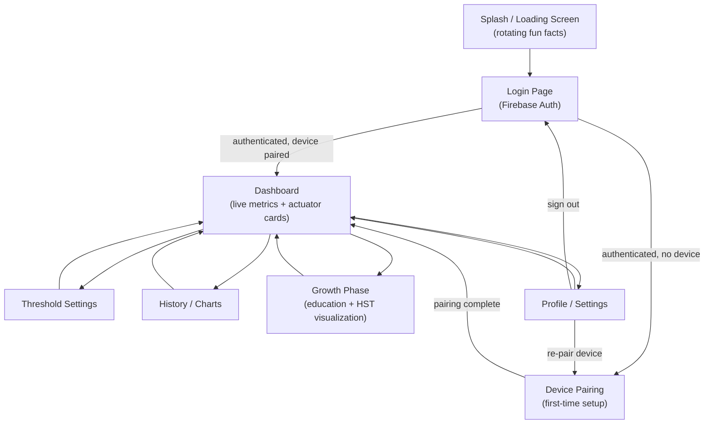
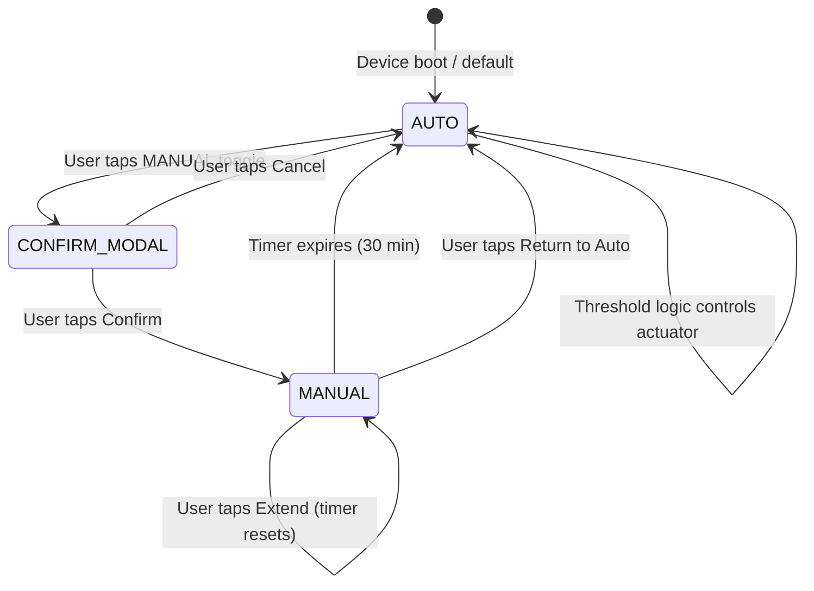

# Snowberry — Navigation & State Flow

## 1. App Navigation Map



### Screen Descriptions

| Screen | Route | Purpose |
|---|---|---|
| Splash / Loading | `/` | Displays Snowberry logo, rotating fun facts about white strawberry farming, and a progress spinner while Firebase Auth session and Firestore listeners initialize. |
| Login | `/login` | Email/password authentication via Firebase Auth. Includes "Sign Up" link for new users. No guest mode. |
| Dashboard | `/dashboard` | Primary screen. Displays four sensor metric cards, four actuator control cards, and quick-link buttons to secondary pages. Real-time data via Firestore `onSnapshot`. |
| Threshold Settings | `/thresholds` | Allows user to configure AUTO-mode trigger thresholds for each actuator (e.g., soil moisture below 55% activates pump). Writes to `devices/{deviceId}/config/thresholds`. |
| History / Charts | `/history` | Time-series charts for temperature, humidity, light intensity, and soil moisture. Date range selector. Reads from `devices/{deviceId}/sensorLog` subcollection. |
| Growth Phase | `/growth` | Educational module. User inputs planting date, app calculates Days After Planting (HST), determines current phase (Vegetative / Flowering / Fruiting), and displays phase-specific information and microclimate guidance. |
| Device Pairing | `/pair` | First-time setup wizard. Guides user through connecting to ESP32 AP hotspot, entering home WiFi credentials, and registering the device with Firebase. |
| Profile / Settings | `/profile` | User account management, notification preferences, device info, sign out, and re-pair device option. |

---

## 2. Dashboard Layout Specification

The dashboard uses a single-column responsive layout. On screens wider than 768px, metric cards arrange into a 2×2 grid and actuator cards into a 2×2 grid. On mobile (<768px), all cards stack vertically in a single column.

### Top Row — Sensor Metric Cards

Four cards displayed in a horizontal row (desktop) or vertical stack (mobile). Each card contains:

| Element | Description |
|---|---|
| **Sensor label** | Capitalized name: "Temperature", "Humidity", "Light Intensity", "Soil Moisture" |
| **Current value** | Large numeric display, e.g., `24.3` |
| **Unit** | Displayed adjacent to value: `°C`, `%`, `lux`, `%` |
| **Status indicator** | Colored dot — green if value is within threshold range, yellow if approaching boundary (within 10%), red if outside threshold. Tooltip on hover shows threshold range. |
| **Trend arrow** | Small arrow icon: ↑ rising, ↓ falling, → stable. Calculated from last 3 readings. |

Card background is white with a subtle left-border accent color unique to each sensor: blue for temperature, teal for humidity, amber for light, green for soil moisture.

### Middle Section — Actuator Control Cards

Four cards, one per actuator. Each card contains:

| Element | Description |
|---|---|
| **Actuator name** | "Growlight", "Water Pump", "Mist Disc", "Cooling Fan" |
| **Actuator icon** | Contextual icon for each actuator type |
| **Status badge** | Pill-shaped badge reading `ON` (green background) or `OFF` (gray background). Reflects real-time `actuators.{name}.state` from Firestore. |
| **Mode toggle** | Segmented control with two options: `AUTO` and `MANUAL`. The currently active mode is highlighted. Tapping the inactive segment triggers the manual override flow (see Section 3). |
| **Manual ON/OFF button** | Large toggle button. Only visible when mode is `MANUAL`. Green when actuator is ON, gray when OFF. Tapping writes directly to `actuators.{name}.state` in Firestore. |
| **Countdown timer** | Displayed below the manual button. Only visible when mode is `MANUAL`. Shows remaining time in `MM:SS` format, counting down from 30:00. Two small text buttons beneath: "Extend" (resets to 30:00) and "Return to Auto" (immediate revert). |

### Bottom Section — Quick Links

A horizontal row of three tappable rectangular buttons:

| Button | Icon | Label | Navigates To |
|---|---|---|---|
| History | 📊 | "View History" | `/history` |
| Thresholds | ⚙️ | "Adjust Thresholds" | `/thresholds` |
| Growth | 🌱 | "Growth Phase" | `/growth` |

---

## 3. Manual Override Flow

### Step-by-Step UX Sequence

This sequence uses the Water Pump actuator as the example. The flow is identical for all four actuators.

**Step 1 — User Initiates Override**
The user taps the `MANUAL` segment on the Water Pump actuator card's mode toggle. The toggle does not change state yet. Instead, a confirmation modal appears.

**Step 2 — Confirmation Modal**

```
┌─────────────────────────────────────────┐
│                                         │
│     Switch to Manual Control?           │
│                                         │
│  The pump will no longer respond to     │
│  soil moisture readings automatically.  │
│  Manual mode will expire in 30 minutes. │
│                                         │
│         [ Cancel ]    [ Confirm ]       │
│                                         │
└─────────────────────────────────────────┘
```

- **Title:** "Switch to Manual Control?"
- **Body:** "The pump will no longer respond to soil moisture readings automatically. Manual mode will expire in 30 minutes."
- **Cancel button:** Dismisses modal, no state change. Mode remains AUTO.
- **Confirm button:** Proceeds to Step 3.

**Step 3 — Manual Mode Activated**
On Confirm:
1. Firestore write: `actuators.pump.mode` → `"MANUAL"`, `actuators.pump.manual_expires_at` → server timestamp + 30 minutes.
2. The mode toggle visually switches to highlight `MANUAL`.
3. The manual ON/OFF button fades in below the toggle.
4. The countdown timer appears, initialized at `30:00`, and begins decrementing every second.
5. The pump's current state (ON or OFF) remains unchanged at the moment of switching — the user must explicitly toggle it.

**Step 4 — User Controls Pump Directly**
The user taps the ON/OFF button to control the pump. Each tap writes to `actuators.pump.state` (boolean) in Firestore. The ESP32 reads this value and actuates the relay accordingly. There is no confirmation modal for ON/OFF toggles during manual mode — the interaction must feel immediate and direct.

**Step 5a — Timer Expires**
When the countdown reaches `00:00`:
1. Firestore write: `actuators.pump.mode` → `"AUTO"`.
2. The mode toggle reverts to highlight `AUTO`.
3. The manual ON/OFF button and countdown timer fade out.
4. A toast notification slides in from the bottom: "Pump has returned to automatic mode."
5. The pump's state is now governed by the threshold logic running on the ESP32.

**Step 5b — User Extends Timer**
At any point during the countdown, the user taps "Extend" beneath the timer:
1. Firestore write: `actuators.pump.manual_expires_at` → server timestamp + 30 minutes.
2. The countdown timer resets to `30:00`.
3. No confirmation modal. Extension is silent and immediate.
4. There is no limit on how many times the user can extend.

**Step 5c — User Returns to Auto Early**
At any point during the countdown, the user taps "Return to Auto":
1. Firestore write: `actuators.pump.mode` → `"AUTO"`.
2. The mode toggle reverts to highlight `AUTO`.
3. The manual ON/OFF button and countdown timer fade out.
4. No confirmation modal needed. The intent to return to AUTO is unambiguous and low-risk.

### State Diagram



---

## 4. Offline State UI Behavior

### Detection Logic

The app determines device offline status by evaluating the `status.realtime.last_seen` timestamp from Firestore. If the difference between the current client time and `last_seen` exceeds 5 minutes (300,000 ms), the device is considered offline.

```
const isOffline = (Date.now() - lastSeen.toMillis()) > 300_000;
```

This check runs on every `onSnapshot` callback and also on a local 60-second interval timer to catch cases where Firestore itself stops emitting updates.

### UI Changes When Offline

**Top Banner (Persistent Warning)**

A full-width banner pinned to the top of the dashboard, directly below the app header. It does not dismiss on tap and cannot be closed by the user. It disappears only when the device comes back online.

- Background color: `bg-amber-100` (light orange/warning)
- Border: `border-l-4 border-amber-500`
- Icon: ⚠️ (warning emoji)
- Text: "Device is offline. Live controls are unavailable."
- Font: `text-sm font-medium text-amber-800`

**Actuator Control Cards — All Disabled**

| Element | Offline Behavior |
|---|---|
| Mode toggle (AUTO/MANUAL) | Grayed out. `opacity-50`, `pointer-events: none`. Tap does nothing. |
| Manual ON/OFF button | Hidden (if in MANUAL mode, the button renders but is grayed and non-interactive). |
| Countdown timer | Paused. Displays "—:—" instead of a live countdown. |
| Status badge | Shows last known state (ON/OFF) with a `(stale)` suffix in smaller text. |

**Sensor Metric Cards — Stale Data Display**

| Element | Offline Behavior |
|---|---|
| Current value | Displays last known reading. |
| Unit | Unchanged. |
| Status indicator | Switches to gray dot regardless of threshold status. |
| Stale label | A small text label `(stale)` appears below the value in `text-gray-400`. |
| Card background | Muted — reduced opacity or desaturated left-border accent. |

**Other Page Behaviors**

| Page | Offline Behavior |
|---|---|
| Threshold Settings | All input fields are editable but the "Save" button is disabled with tooltip: "Cannot save while device is offline." |
| History / Charts | Fully functional. Historical data is already in Firestore and does not depend on live device connectivity. |
| Growth Phase | Fully functional. Content is static education material and HST calculation is client-side. |
| Device Pairing | Functional, since pairing involves direct WiFi connection to the ESP32 AP, not the internet. |

---

## 5. Loading Screen States

### Initial App Load (Splash Screen)

Displayed when the app first opens, before Firebase Auth session is resolved.

```
┌──────────────────────────────────────┐
│                                      │
│                                      │
│          🍓 Snowberry                │
│     Smart Greenhouse Control         │
│                                      │
│        ◌ (progress spinner)          │
│                                      │
│   "White strawberries were first     │
│    bred in Japan and can sell for    │
│    up to $10 per berry."            │
│                                      │
│                                      │
└──────────────────────────────────────┘
```

- Snowberry logo centered vertically and horizontally.
- Below the logo: a circular progress spinner (indeterminate).
- Below the spinner: a rotating fun fact text block. Facts cycle every 5 seconds with a fade transition. The pool of 12 facts is shuffled on each app load so the sequence feels fresh.
- Background: solid white or very light green tint (`bg-green-50`).

### Dashboard Data Loading (Skeleton State)

After authentication succeeds and the user navigates to the dashboard, but before the first `onSnapshot` callback fires with sensor/actuator data:

- Four metric card positions render as skeleton cards: gray pulsing rectangular placeholders (`animate-pulse bg-gray-200 rounded-lg`) matching the dimensions of real cards.
- Four actuator card positions render as skeleton cards with the same pulsing animation.
- Quick-link buttons render normally (they do not depend on live data).
- Skeleton cards are replaced by populated cards the instant `onSnapshot` delivers its first payload. The transition uses a 200ms fade-in (`transition-opacity duration-200`).

### Error State

If the Firestore listener fails to connect after 15 seconds, or if Firebase Auth rejects the session:

```
┌──────────────────────────────────────┐
│                                      │
│                                      │
│          🍓 Snowberry                │
│                                      │
│   Unable to connect to Snowberry.    │
│   Check your internet connection.    │
│                                      │
│           [ Retry ]                  │
│                                      │
│                                      │
└──────────────────────────────────────┘
```

- Same centered layout as splash.
- Error message replaces the fun fact.
- Spinner is replaced by a "Retry" button (`bg-green-600 text-white px-6 py-2 rounded-full`).
- Tapping "Retry" re-initializes Firebase listeners and returns to the splash/loading state.
