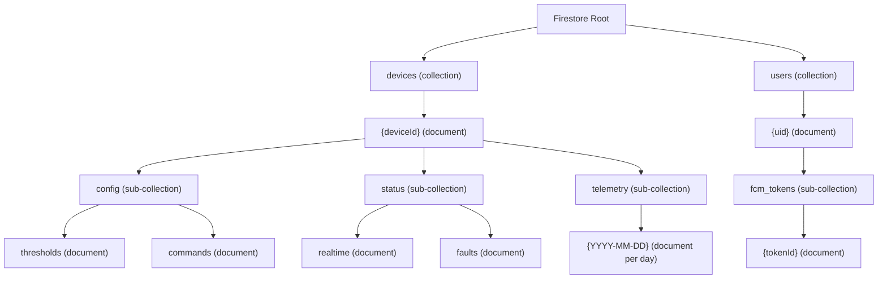

# Firestore Schema & Data Models — Snowberry Smart Greenhouse

| Field            | Value                                      |
| ---------------- | ------------------------------------------ |
| Document Version | 1.0                                        |
| Date             | 2026-07-02                                 |
| Project          | Snowberry — Smart Greenhouse 4-in-1        |
| Backend          | Firebase Firestore (Spark Tier)            |
| Status           | Draft                                      |

---

## 1. Design Principles

**Quota-Conscious NoSQL Architecture:**

Every design decision in this schema is driven by the hard limits of the Firebase Spark free tier: 20,000 writes/day and 50,000 reads/day. The following principles minimize document operations:

1. **Minimize document count** — Batch related fields into a single document rather than creating one document per field. The entire realtime status of the device is a single document read, not four sensor documents plus four actuator documents.

2. **Payload minification for telemetry** — Telemetry entries use abbreviated field names (`t` instead of `temperature_c`) because these entries are written 1,440 times per day. Config documents use full descriptive names because they are written fewer than 10 times per day. Optimize for the hot path.

3. **onSnapshot over polling** — The web app uses Firestore's `onSnapshot` real-time listener, which holds a persistent connection and receives incremental updates. This counts as 1 read per received update, compared to polling which would cost 1 read per poll interval regardless of whether data changed.

4. **Flat structure where possible** — Sub-collections are used only when documents within them have different access patterns or lifecycle requirements (e.g., telemetry documents are date-partitioned for efficient range queries and eventual cleanup, while config documents are long-lived singletons).

5. **One document per day for telemetry** — Instead of writing one document per minute (1,440 documents/day = 1,440 writes), telemetry is appended as array entries within a single daily document. Each array append is still one Firestore write, but it keeps document count low and makes date-range queries trivial.

---

## 2. Top-Level Collection Structure



**Document Path Summary:**

| Path                                          | Purpose                           | Write Frequency     |
| --------------------------------------------- | --------------------------------- | ------------------- |
| `devices/{deviceId}`                          | Device metadata, owner binding    | Once on registration|
| `devices/{deviceId}/config/thresholds`        | All control thresholds            | ~2–5 per day        |
| `devices/{deviceId}/config/commands`          | Manual override commands          | ~5–10 per day       |
| `devices/{deviceId}/status/realtime`          | Live sensor + actuator snapshot   | Every 60 seconds    |
| `devices/{deviceId}/status/faults`            | Recent fault event log            | ~0–5 per day        |
| `devices/{deviceId}/telemetry/{YYYY-MM-DD}`   | Minute-by-minute data array       | Every 60 seconds    |
| `users/{uid}`                                 | User profile metadata             | Once on signup      |
| `users/{uid}/fcm_tokens/{tokenId}`            | Push notification tokens          | On token refresh     |

---

## 3. Schema: `devices/{deviceId}/config/thresholds`

This document stores all configurable control thresholds. Full descriptive field names are used because this document is rarely written (fewer than 10 writes/day). The ESP32 reads this document on boot and whenever it detects a change via periodic polling (every 30 seconds).

```json
{
  "temp_low": 18.0,
  "temp_high": 26.0,
  "rh_low": 60.0,
  "rh_high": 80.0,
  "soil_low": 40.0,
  "soil_high": 70.0,
  "lux_low": 2000,
  "lux_high": 5000,
  "pump_pulse_ms": 5000,
  "soak_period_ms": 60000,
  "planting_date": "2026-06-01",
  "updated_at": 1751457600000,
  "updated_by": "uid_abc123"
}
```

**Field Definitions:**

| Field             | Type   | Default | Min    | Max    | Unit | Description                                      |
| ----------------- | ------ | ------- | ------ | ------ | ---- | ------------------------------------------------ |
| `temp_low`        | float  | 18.0    | 10.0   | 35.0   | °C   | Fan/mist activates cooling below this → fan OFF trigger |
| `temp_high`       | float  | 26.0    | 10.0   | 35.0   | °C   | Fan activates when temp exceeds this              |
| `rh_low`          | float  | 60.0    | 30.0   | 95.0   | %RH  | Mist disc ON trigger                              |
| `rh_high`         | float  | 80.0    | 30.0   | 95.0   | %RH  | Mist disc OFF trigger, fan ON trigger             |
| `soil_low`        | float  | 40.0    | 10.0   | 90.0   | %    | Pump pulsed watering ON trigger                   |
| `soil_high`       | float  | 70.0    | 10.0   | 90.0   | %    | Pump OFF trigger                                  |
| `lux_low`         | int    | 2000    | 500    | 50000  | lux  | Growlight ON trigger                              |
| `lux_high`        | int    | 5000    | 500    | 50000  | lux  | Growlight OFF trigger                             |
| `pump_pulse_ms`   | int    | 5000    | 1000   | 30000  | ms   | Duration of each pump ON pulse                    |
| `soak_period_ms`  | int    | 60000   | 10000  | 300000 | ms   | Wait time between pump pulses for water absorption|
| `planting_date`   | string | —       | —      | —      | ISO  | Date the crop was planted, used for HST calculation|
| `updated_at`      | number | —       | —      | —      | ms   | Unix timestamp of last update                     |
| `updated_by`      | string | —       | —      | —      | —    | Firebase Auth UID of the user who last updated    |

**Validation Rules (enforced in web app UI):**

- `temp_low < temp_high`
- `rh_low < rh_high`
- `soil_low < soil_high`
- `lux_low < lux_high`
- `pump_pulse_ms <= soak_period_ms`

---

## 4. Schema: `devices/{deviceId}/status/realtime`

This is the single document that powers the live dashboard. The web app attaches an `onSnapshot` listener to this document on page load. The ESP32 writes to this document every 60 seconds.

```json
{
  "sensors": {
    "temperature_c": 23.4,
    "humidity_pct": 67.2,
    "lux": 3450,
    "soil_pct": 55.8,
    "psu_voltage": 12.1
  },
  "actuators": {
    "growlight": {
      "mode": "AUTO",
      "state": false,
      "manual_until": null
    },
    "pump": {
      "mode": "MANUAL",
      "state": true,
      "manual_until": 1751457600000
    },
    "mist": {
      "mode": "AUTO",
      "state": true,
      "manual_until": null
    },
    "fan": {
      "mode": "AUTO",
      "state": false,
      "manual_until": null
    }
  },
  "device": {
    "online": true,
    "wifi_rssi": -52,
    "ip_address": "192.168.1.47",
    "firmware_version": "1.0.0",
    "uptime_seconds": 86423,
    "free_heap_bytes": 187392,
    "nvs_synced": true
  },
  "fault": {
    "active_code": null,
    "active_message": null,
    "last_fault_code": "F-06",
    "last_fault_at": 1751371200000
  },
  "last_seen": 1751457540000
}
```

**Field Definitions:**

| Section      | Field               | Type    | Description                                                    |
| ------------ | ------------------- | ------- | -------------------------------------------------------------- |
| `sensors`    | `temperature_c`     | float   | Current air temperature from SHT30-D                           |
| `sensors`    | `humidity_pct`      | float   | Current relative humidity from SHT30-D                         |
| `sensors`    | `lux`               | int     | Current light intensity from BH1750                            |
| `sensors`    | `soil_pct`          | float   | Current soil moisture from Capacitive V2.0, calibrated to 0–100% |
| `sensors`    | `psu_voltage`       | float   | Input supply voltage measured via voltage divider on ADC       |
| `actuators`  | `mode`              | string  | `AUTO` or `MANUAL`                                             |
| `actuators`  | `state`             | boolean | `true` = ON, `false` = OFF                                    |
| `actuators`  | `manual_until`      | number\|null | Unix timestamp (ms) when MANUAL mode expires. Null if AUTO |
| `device`     | `online`            | boolean | Set to `true` on every write; client checks `last_seen` age   |
| `device`     | `wifi_rssi`         | int     | WiFi signal strength in dBm                                   |
| `device`     | `ip_address`        | string  | Local IP address on the WiFi network                           |
| `device`     | `firmware_version`  | string  | Semantic version of the running firmware                       |
| `device`     | `uptime_seconds`    | int     | Seconds since last boot                                        |
| `device`     | `free_heap_bytes`   | int     | Available heap memory for diagnostics                          |
| `device`     | `nvs_synced`        | boolean | Whether NVS thresholds match Firestore thresholds              |
| `fault`      | `active_code`       | string\|null | Currently active fault code, or null if no fault            |
| `fault`      | `active_message`    | string\|null | Human-readable description of active fault                  |
| `fault`      | `last_fault_code`   | string\|null | Most recent fault code (even if resolved)                   |
| `fault`      | `last_fault_at`     | number\|null | Timestamp of most recent fault occurrence                   |
| —            | `last_seen`         | number  | Unix timestamp (ms) of this document write                     |

**Estimated Document Size:** ~650 bytes (well within Firestore's 1 MiB document limit).

---

## 5. Schema: `devices/{deviceId}/telemetry/{YYYY-MM-DD}`

Telemetry uses minified field names to reduce bandwidth and storage. One document is created per calendar day. Each minute, the ESP32 appends a new entry to the `d` (data) array using `FieldValue.arrayUnion()`.

**Minification Key Mapping:**

| Minified Key | Full Name         | Type    | Unit  |
| ------------ | ----------------- | ------- | ----- |
| `t`          | temperature_c     | float   | °C    |
| `h`          | humidity_pct      | float   | %RH   |
| `l`          | lux               | int     | lux   |
| `s`          | soil_pct          | float   | %     |
| `gl`         | growlight_on      | boolean | —     |
| `p`          | pump_on           | boolean | —     |
| `m`          | mist_on           | boolean | —     |
| `f`          | fan_on            | boolean | —     |
| `ts`         | timestamp         | number  | ms    |

**Sample Document (`devices/snowberry-001/telemetry/2026-07-02`):**

```json
{
  "device_id": "snowberry-001",
  "date": "2026-07-02",
  "d": [
    {
      "t": 22.8,
      "h": 65.4,
      "l": 3200,
      "s": 52.1,
      "gl": false,
      "p": false,
      "m": true,
      "f": false,
      "ts": 1751414400000
    },
    {
      "t": 22.6,
      "h": 66.1,
      "l": 3180,
      "s": 51.8,
      "gl": false,
      "p": true,
      "m": true,
      "f": false,
      "ts": 1751414460000
    },
    {
      "t": 22.9,
      "h": 67.3,
      "l": 3250,
      "s": 53.4,
      "gl": false,
      "p": false,
      "m": false,
      "f": false,
      "ts": 1751414520000
    }
  ]
}
```

**Document Size Estimate:**

Each entry in the `d` array:
- 9 fields × ~8 bytes average per field (key + value + overhead) = ~72 bytes per entry
- Including JSON structural characters (braces, commas, colons): ~90 bytes per entry

Full day at 1-minute intervals:
- 1,440 entries × 90 bytes = **129,600 bytes (~127 KB)**
- Plus document envelope (`device_id`, `date`, `d` key): ~50 bytes
- **Total estimated document size: ~127 KB per day**

This is well within Firestore's 1 MiB (1,048,576 bytes) document size limit, using approximately 12.1% of the maximum.

**Array Append Strategy:**

The ESP32 does not read-modify-write the entire array. It uses the Firestore REST API equivalent of `FieldValue.arrayUnion()` to atomically append a single entry. This costs 1 write per append. On day rollover (midnight local time), the ESP32 begins writing to a new document path (`telemetry/2026-07-03`). Firestore auto-creates the document on first write.

---

## 6. Schema: `devices/{deviceId}/status/faults`

This document stores an array of recent fault events for display in the dashboard fault log and for triggering FCM notifications.

```json
{
  "device_id": "snowberry-001",
  "events": [
    {
      "code": "F-01",
      "message": "SHT30 temperature/humidity sensor not responding. I2C NACK on 3 consecutive reads.",
      "severity": "critical",
      "timestamp": 1751371200000,
      "resolved": true,
      "resolved_at": 1751371500000
    },
    {
      "code": "F-06",
      "message": "Water pump continuously ON for >5 minutes with no soil moisture increase. Possible blockage.",
      "severity": "critical",
      "timestamp": 1751414400000,
      "resolved": false,
      "resolved_at": null
    },
    {
      "code": "F-04",
      "message": "Device offline. No telemetry write for >5 minutes.",
      "severity": "warning",
      "timestamp": 1751300000000,
      "resolved": true,
      "resolved_at": 1751300600000
    }
  ],
  "last_updated": 1751414400000
}
```

**Field Definitions:**

| Field          | Type         | Description                                                        |
| -------------- | ------------ | ------------------------------------------------------------------ |
| `device_id`    | string       | Device identifier for cross-reference                              |
| `events`       | array        | Array of fault event objects, most recent last                     |
| `code`         | string       | Fault code from the fault table (F-01 through F-06)                |
| `message`      | string       | Human-readable description of what happened                       |
| `severity`     | string       | `critical` or `warning`                                            |
| `timestamp`    | number       | Unix timestamp (ms) when the fault was first detected              |
| `resolved`     | boolean      | Whether the fault condition has cleared                            |
| `resolved_at`  | number\|null | Unix timestamp (ms) when the fault was resolved, or null           |
| `last_updated` | number       | Unix timestamp (ms) of the most recent write to this document      |

**Array Management:**

- Maximum array length: 50 events. When the array exceeds 50 entries, the oldest resolved event is removed before appending.
- Unresolved events are never pruned regardless of array length.

---

## 7. Schema: `users/{uid}/fcm_tokens/{tokenId}`

Each sub-document represents a single FCM registration token for a specific browser or device. A user may have multiple tokens (desktop browser, mobile browser).

```json
{
  "token": "eKzF8r4t5Rk:APA91bH7x2k4mNpQ3vBcW1sYjL9dR6uA0fGhI3kLmNoP5qRsT7uVwXyZ1a2B3cD4eF5gH6iJ7kL8mN9oP0qR1sT2uV3wX4yZ",
  "platform": "web",
  "browser": "Chrome 126",
  "created_at": 1751414400000,
  "last_refreshed": 1751457600000,
  "device_id": "snowberry-001"
}
```

**Field Definitions:**

| Field            | Type   | Description                                                    |
| ---------------- | ------ | -------------------------------------------------------------- |
| `token`          | string | FCM registration token string                                  |
| `platform`       | string | `web`, `android`, or `ios` (v1.0 targets web only)             |
| `browser`        | string | User agent browser name and version for diagnostics            |
| `created_at`     | number | Unix timestamp (ms) when the token was first registered        |
| `last_refreshed` | number | Unix timestamp (ms) of the most recent token refresh           |
| `device_id`      | string | The Snowberry device ID this user is monitoring                |

**Token Lifecycle:**

- Tokens are created when the user grants notification permission in the browser
- Tokens are refreshed when FCM rotates them (the `onTokenRefresh` callback updates this document)
- Stale tokens (not refreshed in 30 days) should be cleaned up to avoid sending to invalid tokens

---

## 8. Firestore Security Rules

The following rules enforce that each user can only access their own device data and user profile. No public access is permitted.

```javascript
rules_version = '2';

service cloud.firestore {
  match /databases/{database}/documents {

    // Default: deny all access
    match /{document=**} {
      allow read, write: if false;
    }

    // Device document: only the owner can read/write
    match /devices/{deviceId} {
      allow read, write: if request.auth != null
                         && request.auth.uid == resource.data.owner_uid;

      // Allow creation if the user is setting themselves as owner
      allow create: if request.auth != null
                    && request.auth.uid == request.resource.data.owner_uid;

      // Config sub-collection: thresholds and commands
      match /config/{configDoc} {
        allow read: if request.auth != null
                    && request.auth.uid == get(/databases/$(database)/documents/devices/$(deviceId)).data.owner_uid;

        allow write: if request.auth != null
                     && request.auth.uid == get(/databases/$(database)/documents/devices/$(deviceId)).data.owner_uid;
      }

      // Status sub-collection: realtime and faults
      match /status/{statusDoc} {
        allow read: if request.auth != null
                    && request.auth.uid == get(/databases/$(database)/documents/devices/$(deviceId)).data.owner_uid;

        // ESP32 writes status via service account or REST with custom token
        // User can also read but typically does not write status
        allow write: if request.auth != null
                     && request.auth.uid == get(/databases/$(database)/documents/devices/$(deviceId)).data.owner_uid;
      }

      // Telemetry sub-collection: date-partitioned daily documents
      match /telemetry/{dateDoc} {
        allow read: if request.auth != null
                    && request.auth.uid == get(/databases/$(database)/documents/devices/$(deviceId)).data.owner_uid;

        // ESP32 writes telemetry via REST API with device credentials
        allow write: if request.auth != null
                     && request.auth.uid == get(/databases/$(database)/documents/devices/$(deviceId)).data.owner_uid;
      }
    }

    // User profile: only the authenticated user can access their own data
    match /users/{uid} {
      allow read, write: if request.auth != null
                         && request.auth.uid == uid;

      // FCM tokens sub-collection
      match /fcm_tokens/{tokenId} {
        allow read, write: if request.auth != null
                           && request.auth.uid == uid;
      }
    }
  }
}
```

**Notes on ESP32 Authentication:**

The ESP32 authenticates to Firestore using the Firebase REST API with a custom token or service account credentials. In the security rules above, the ESP32's writes are authorized because it authenticates as the owner UID. For Spark tier (which does not support Cloud Functions for custom token minting), the ESP32 uses the Firebase Auth REST API with the owner's email/password to obtain an ID token, then uses that token for Firestore REST calls. The email/password are stored in NVS flash on the device.

---

## 9. Quota Budget Table

### Daily Write Budget (Spark Limit: 20,000 writes/day)

| Operation                          | Document Path                                  | Trigger                     | Writes/Day | Notes                                      |
| ---------------------------------- | ---------------------------------------------- | --------------------------- | ---------- | ------------------------------------------ |
| Telemetry array append             | `devices/{id}/telemetry/{date}`                | Every 60s from ESP32        | 1,440      | 1 write per arrayUnion append              |
| Realtime status update             | `devices/{id}/status/realtime`                 | Every 60s from ESP32        | 1,440      | Full document overwrite each cycle         |
| Threshold config update            | `devices/{id}/config/thresholds`               | User saves from web app     | 5          | Estimated max 5 changes per day            |
| Manual override command            | `devices/{id}/config/commands`                 | User toggles actuator mode  | 10         | Estimated max 10 toggles per day           |
| Fault event write                  | `devices/{id}/status/faults`                   | On fault detection/resolve  | 5          | Estimated max 5 fault events per day       |
| FCM token registration/refresh     | `users/{uid}/fcm_tokens/{tokenId}`             | On permission grant/refresh | 2          | Rare, typically once per session           |
| **Total Daily Writes**             |                                                |                             | **2,902**  |                                            |
| **Percentage of Spark Limit**      |                                                |                             | **14.5%**  | Headroom: 17,098 writes remaining          |

### Daily Read Budget (Spark Limit: 50,000 reads/day)

| Operation                          | Document Path                                  | Trigger                       | Reads/Day | Notes                                      |
| ---------------------------------- | ---------------------------------------------- | ----------------------------- | --------- | ------------------------------------------ |
| Dashboard onSnapshot listener      | `devices/{id}/status/realtime`                 | 1 read per update received    | 1,440     | Listener stays open, receives pushes       |
| ESP32 threshold polling            | `devices/{id}/config/thresholds`               | Every 30s from ESP32          | 2,880     | ESP32 checks for config changes            |
| ESP32 command polling              | `devices/{id}/config/commands`                 | Every 5s from ESP32           | 17,280    | Frequent check for manual override cmds    |
| Threshold page load                | `devices/{id}/config/thresholds`               | User opens settings page      | 5         | Estimated 5 page loads per day             |
| Fault log read                     | `devices/{id}/status/faults`                   | On dashboard load + listener  | 1,440     | Bundled with onSnapshot if same listener   |
| Trend history 24h query            | `devices/{id}/telemetry/{date}`                | User views 24h chart          | 6         | 2 docs × 3 views per day                  |
| Trend history 7d query             | `devices/{id}/telemetry/{date}`                | User views 7d chart           | 7         | 7 docs × 1 view per day                   |
| Trend history 30d query            | `devices/{id}/telemetry/{date}`                | User views 30d chart          | 30        | 30 docs × ~1 view per day                 |
| Security rules get() calls         | `devices/{id}` (owner_uid lookup)              | On every sub-collection read  | 5,000     | Estimated from rules evaluation overhead   |
| **Total Daily Reads**              |                                                |                               | **28,088** |                                            |
| **Percentage of Spark Limit**      |                                                |                               | **56.2%** | Headroom: 21,912 reads remaining           |

### Optimization Notes

1. **ESP32 command polling at 5-second intervals is the largest read consumer** (17,280 reads/day = 34.6% of quota). If quota becomes tight, this interval can be increased to 10 seconds (8,640 reads/day) or 15 seconds (5,760 reads/day) with acceptable latency for manual override responsiveness.

2. **Security rules `get()` calls** are counted as reads. Each sub-collection access triggers a `get()` on the parent `devices/{deviceId}` document to verify `owner_uid`. This is an unavoidable cost of UID-scoped security. The estimate of 5,000/day accounts for all sub-collection reads triggering a parent document lookup.

3. **Trend history reads are negligible** because telemetry is packed into daily documents. A 30-day chart query costs only 30 reads, not 43,200 reads (one per data point).

4. **Total budget utilization is 14.5% writes and 56.2% reads**, leaving substantial headroom for growth, debugging, and occasional spikes from multiple browser sessions.

### Summary

| Resource       | Spark Limit | Daily Usage | Utilization | Headroom    |
| -------------- | ----------- | ----------- | ----------- | ----------- |
| Writes         | 20,000      | 2,902       | 14.5%       | 17,098      |
| Reads          | 50,000      | 28,088      | 56.2%       | 21,912      |
| Storage        | 1 GiB       | ~127 KB/day | ~4.6 MB/mo  | ~995 MB     |
| Document Size  | 1 MiB max   | 127 KB max  | 12.1%       | 921 KB      |
